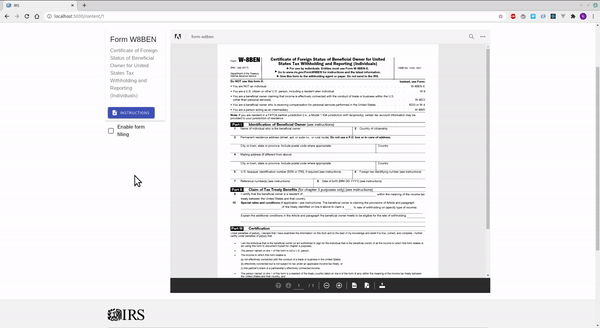
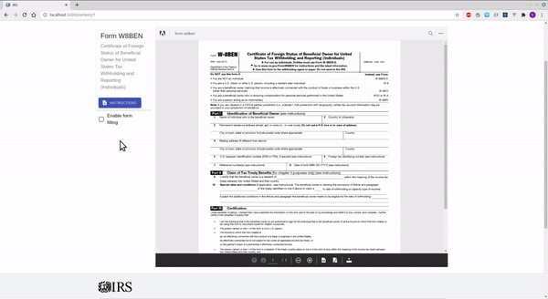
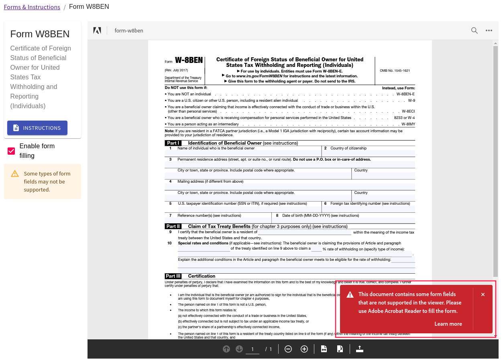

# Consumption, Measurement and Analysis of Public IRS Information

## Use case

Due to the current times of COVID-19, access to digital resources is increasing. Therefore, the IRS is interested in providing a better service to access your forms, integrating the forms and instructions on its home page.

The IRS needs to obtain data on user interaction with the forms and their corresponding instructions, such as:
- Total user views of forms and instructions
- User views for each form
- Total downloads per form

Because users can search in the instructions and access external resources provided in the instructions, it is recommended that you provide information about user searches and access to external resources by users.

Lastly, forms have fields to fill out, you should consider allowing users to do so.

## Video

- [Resource][video_demostration]

## Docs

- [Google analytics dashboard][google-analytics-doc]

## PDF Files used

The files used are in `public/forms` folder.

## Technologies

- [React JS][react_js]

## Dependencies

- Node js v14.3
- [Material UI][material_ui]
- [Joi][joi]
- [Lodash][lodash]

### External libraries

- [Abode PDF view SDK][adobe_view_sdk_link]
- [Google analytics][google_analytics_link]

## Application builder

- [Create react app][create_react_app]

## Environment Variables

- REACT_APP_ADOBE_CLIENT_VIEW_ID
  - The client ID for use the document services PDF
- REACT_APP_ANALYTICS_ID
  - The application tracker ID of Google analytics (You can view [here][google-analytics-doc] how to get the traker ID)

## Development deploy

Create a `.env` file in the project root directory and set de **Enviroment Variables**:

```
REACT_APP_ADOBE_CLIENT_VIEW_ID=some_value
REACT_APP_ANALYTICS_ID=some_value
```

Install dependencies:

```bash
yarn install
```

Start app in development mode:

```bash
yarn run start
```

Your app will be located in http://localhost:3000.

## Production deploy

Because the app was created with [create react app][create_react_app], you can found how to deploy the app in services like to [Heroku][heroku] in the [deployment section][create-react-app-deployment]. 

## Issues found

### Update parameters over a document showed

No way was found in the SDK documentation to update the parameters of a displayed document. Therefore is necessary create again an AdobeDC.View instance and call the previewFile method.

For example, the document reload when the `enableFormFilling` parameter is actualized:



When we want to view again a document in `LIGHT_BOX` mode, we need reload the document again:



That can be solved simulating `LIGHT_BOX` mode with a dialog component.

### Enable form filling

Some documents have fields doesn't supported to the SDK:




<!-- Technologies -->
[react_js]: https://reactjs.org/

<!-- Dependencies -->

[material_ui]: https://material-ui.com/
[joi]: https://www.npmjs.com/package/joi
[lodash]: https://www.npmjs.com/package/lodash

<!-- External libraries -->

[adobe_view_sdk_link]: https://www.adobe.com/devnet-docs/dcsdk_io/viewSDK/
[google_analytics_link]: https://developers.google.com/analytics/devguides/collection/analyticsjs

<!-- Application builder -->

[create_react_app]: https://create-react-app.dev/

<!-- Docs -->

[google-analytics-doc]: ./docs/GoogleAnalytics.md
[create-react-app-deployment]: https://create-react-app.dev/docs/deployment

<!-- Web pages -->

[heroku]: https://www.heroku.com/

<!-- Own resources -->

[video_demostration]: https://www.youtube.com/watch?v=KVKAEfeufRs
